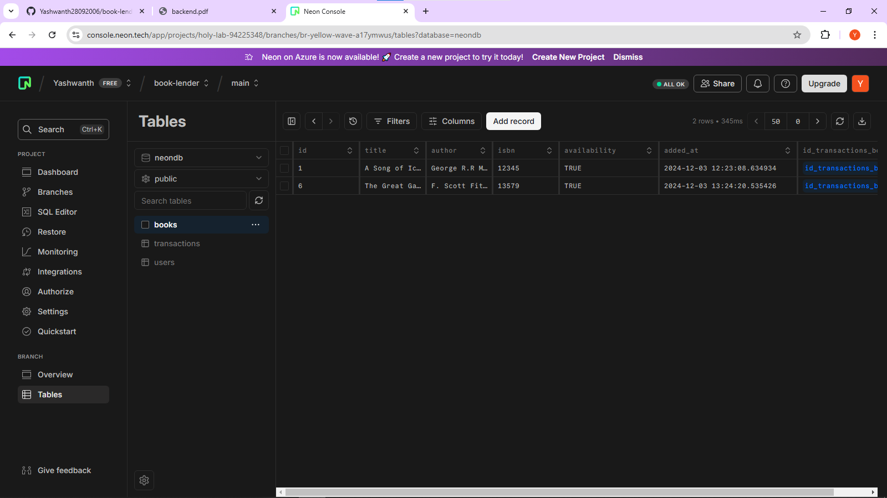
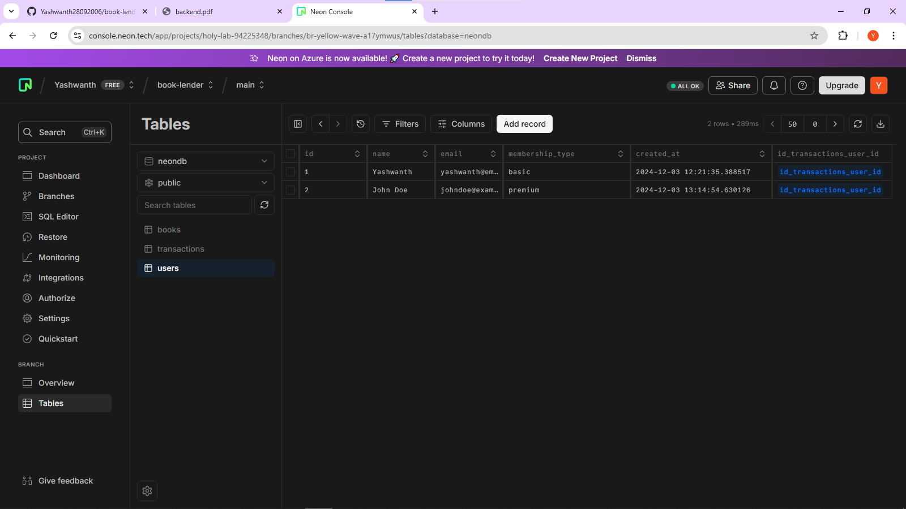
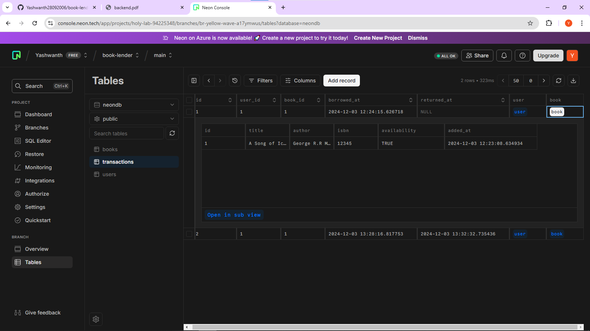

# Technology Stack used:
1. Server environment: Node JS
2. Web Server: Express JS
3. Database: PostgreSQL (neon tech cloud)
## *Note: .env file is not given in the zip file submitted*
# Screenshots of database
## 1. Books Table:

## 2. Users Table:

## 3. Transactions Table:

